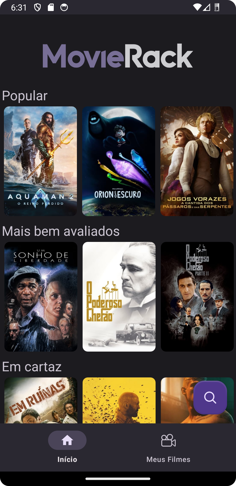
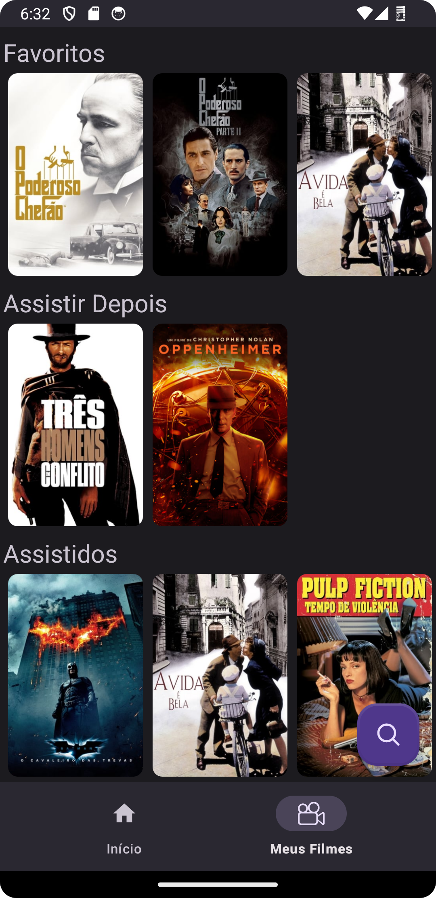

<h1 align="center">
   

</h1>

<h4 align="center">MovieRack é um app simples que serve como uma agenda de filmes.</h4>

    
    

<h4 align="center">Nele os usuários podem pesquisar e salvar seus filmes favoritos, marcá-los como assistidos ou para assistir mais tarde.</h4>

    
    

