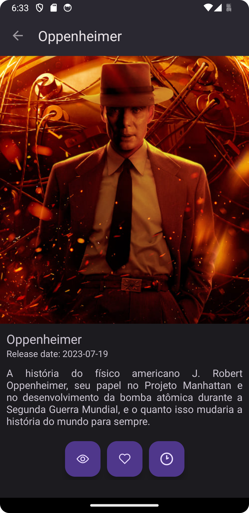

<h1 align="center">
   

</h1>

<h4 align="center">MovieRack é um app simples que serve como uma agenda de filmes.</h4>

## Imagens do App

    
    
    
    

<h5 align="center">Os usuários podem pesquisar e salvar seus filmes favoritos, além de marcá-los como assistidos ou para assistir mais tarde.</h5>

